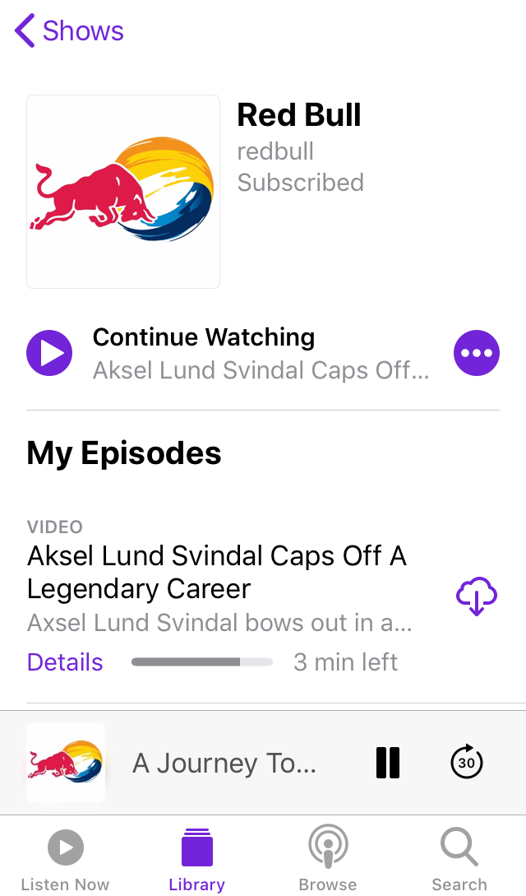

<hr>
<h2 align="center">YouTube Goes Podcast</h3>
<h4 align="center">🎞 👉🎙 Put youtube channel get podcast audio feed 🎞 👉🎙</h3>
<hr>

This API is created mainly to receive youtube channel and return audio podcast feed that you can use in your favorite podcast app.

## Features/Roadmap
* [x] Generate podcast feed for youtube channel
* [x] Filter only wanted videos
* [x] Use audio file for videos
* [x] Get trending channels (base on trending videos)

### Examples
Use this url `https://ygp.psmarcin.dev/feed/channel/UCblfuW_4rakIf2h6aqANefA` in your favorite podcast app. It works on desktop and mobile too. Tested on:
* iPhone Podcast App
* iTunes MacOS App
* Plex Web App
* Plex iOS App

### Screens


## Development

### Requirements
1. Go in version `>=1.9`, more: https://golang.org/dl/
1. Docker, more: https://docs.docker.com/install/
1. Modd (auto restart), more https://github.com/cortesi/modd

### Environment variables
Example environment variables
```bash
APP_ENV=development
GOOGLE_API_KEY=<YOUR_YOUTUBE_API_KEY>
PORT=8080
API_URL=http://localhost:8080/
```

### Build
1. `make build`

### Test
1. `make test`

### Develop
1. `docker-compose up -d`
1. `make dev`

### Debug
1. `docker-compose up -d`
1. `make debug`

### Database
On every run we start migrations to be sure that database is up to date.

## Credits
This project uses big part of https://github.com/rylio/ytdl. I couldn't use it as dependencies because there was conflict with `logrus`. Will use it as dependency as soon as it will fix that problem.
